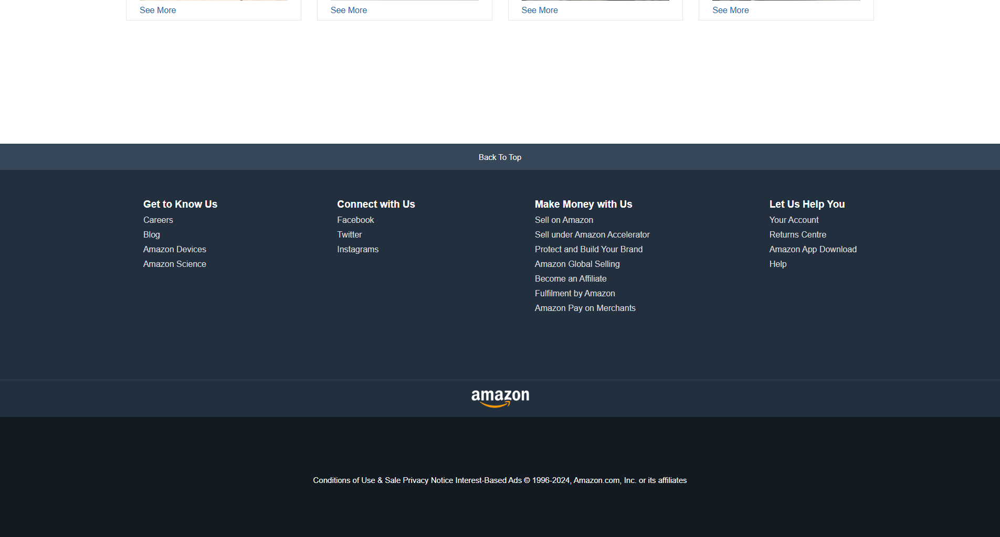

📦 Amazon Clone 

Amazon Clone is a front-end project built using only HTML and CSS.
It recreates the look and feel of an e-commerce website, featuring a responsive header with navigation and search bar, a product grid with images and prices, and a structured footer.

This project focuses on practicing web layouts, styling with Flexbox and CSS Grid, and responsive design principles. It is a static clone, so no backend or JavaScript functionality is included.

✨ Features :

Responsive header with logo, search bar, and navigation

Product listing grid with images, titles, and prices

Hover effects for an interactive UI feel

Clean footer section similar to an e-commerce site

Built entirely with HTML & CSS (no frameworks, no JS)

📸 Screenshots : 

